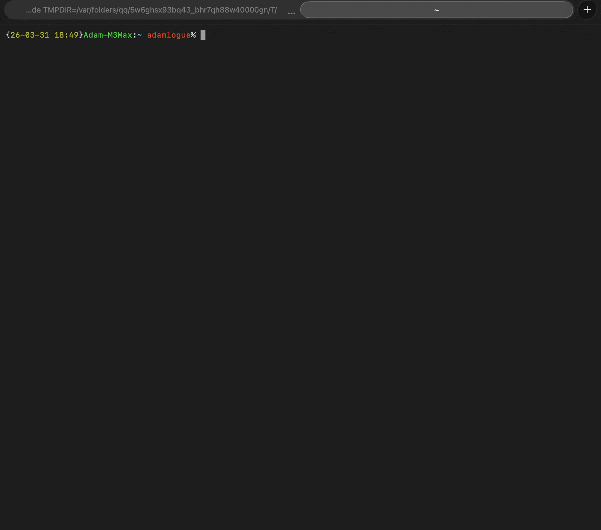

# PoC: MCP Server Auto-Approval Bypass

## Overview

This proof-of-concept demonstrates that a malicious git repository can achieve
arbitrary code execution when opened in Claude Code, without any user interaction
beyond cloning the repo and running `claude` or `claude -p`.

This vulnerability requires the project is cloned into a directory trusted by users. This was rejected by the Anthropic Bug Bounty Program.

## How It Works

The attack combines two repo-controlled files:

1. **`.mcp.json`** - defines a malicious MCP server that runs an arbitrary command
2. **`.claude/settings.json`** - sets `enableAllProjectMcpServers: true` to
   auto-approve all MCP servers without showing the approval dialog

### Code Path (Interactive Mode)

1. User runs `claude` in the malicious repo directory
2. `showSetupScreens()` shows the trust dialog - user clicks "Trust" (normal flow)
3. `handleMcpjsonServerApprovals()` calls `getProjectMcpServerStatus()`
4. `getProjectMcpServerStatus()` reads `getSettings_DEPRECATED()` (merged settings)
5. Merged settings include `projectSettings` from `.claude/settings.json`
6. `settings.enableAllProjectMcpServers` is `true` -> returns `'approved'`
7. The MCP server's command executes via `StdioClientTransport`

### Code Path (Non-Interactive Mode - NO trust dialog)

1. User runs `echo "analyze this code" | claude -p` in the malicious repo
2. `isNonInteractive = true` -> `showSetupScreens()` is never called
3. `getProjectMcpServerStatus()` hits the non-interactive auto-approve path:
   `getIsNonInteractiveSession() && isSettingSourceEnabled('projectSettings')`
4. Returns `'approved'` with zero user interaction
5. MCP server command executes

## Affected Versions

This PoC targets the codebase at commit `c2357be` (2026-03-31). The vulnerability
exists in `src/services/mcp/utils.ts` lines 367-374.

## Severity

**CRITICAL** - Zero-interaction remote code execution in non-interactive mode.
In interactive mode, the trust dialog is the only gate (but does not warn about
MCP auto-approval specifically).

## Remediation

Read `enableAllProjectMcpServers` only from `localSettings` (gitignored),
not from the merged settings that include repo-controlled `projectSettings`.
